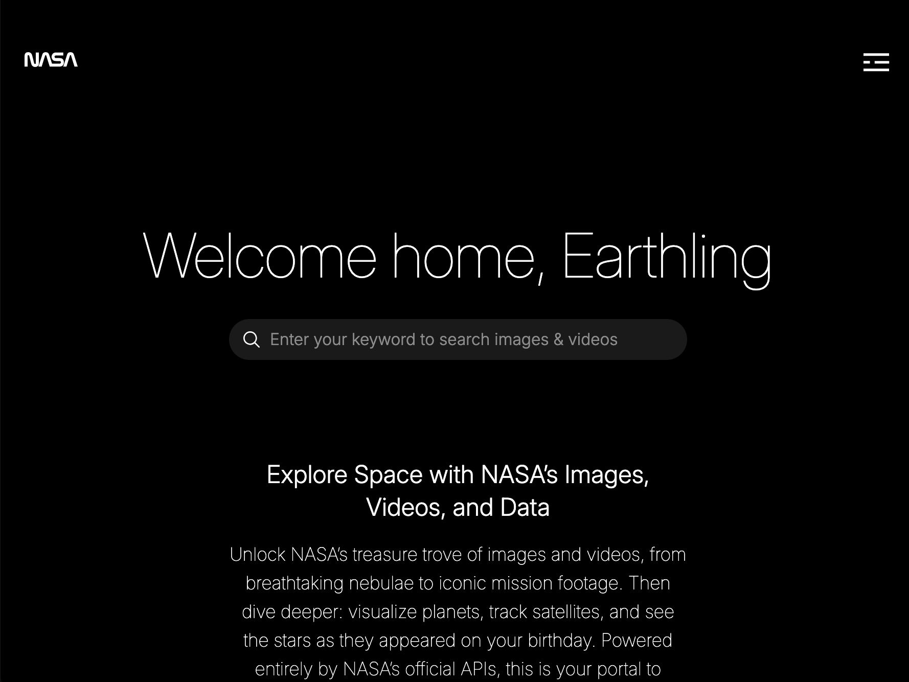

# NASA App

A full-stack web application built with React and Express that connects users to real-time NASA data. Explore the universe through high-resolution images from the Astronomy Picture of the Day (APOD), browse Mars rover photos, and dive into space-related content—all powered by NASA's public APIs. Fast, responsive, and designed for space lovers.


#### 🌐 Demo

Check out the live version of the app:

**🔗 [demo.codebrew.cc/a5de8ad3](https://demo.codebrew.cc/a5de8ad3)**

> Hosted version of the NASA App project with full frontend + backend integration.



---

## 🚀 Getting Started

> ⚠️ **Requires Node.js v22 or higher**

Make sure you have Node.js v22+ installed. You can check your version with:

```bash
node -v
```

### 1. Clone the Repository

```bash
git clone https://github.com/iestyn02/nasa.codebrew.cc.git
cd nasa.codebrew.cc
```

### 2. Install Dependencies

```bash
npm install
```

### 3. Start the Development Servers

```bash
npm run start
```

> This command starts both the frontend and backend servers in parallel, allowing them to run simultaneously during development.

> The `.env` file will be auto-created on first run via a setup script. You'll be prompted to enter API keys and other config values.

&nbsp;

## ⚙️ Environment Variables (`.env`)

The application uses a `.env` file to manage environment-specific settings like ports and API keys. This file is automatically created for you on first run via a setup script.

### 🔑 Required Variables

| Variable              | Description                                         | Default                                      |
|-----------------------|-----------------------------------------------------|----------------------------------------------|
| `PORT`                | Port on which the server will run                   | `3000`                                       |
| `NASA_API_KEY`        | Your NASA API key *(or use `DEMO_KEY`)*             | `DEMO_KEY`                                   |
| `VITE_GEO_APIFY_KEY`  | API key for GeoApify geolocation service            | `16b327cb8cd64ca19a688553da6a6630`           |
| `VITE_API_URL`        | Base URL for backend API                            | `http://localhost:3000/`              |

> If the `.env` file is missing, a setup script will prompt you to enter these values and generate it automatically.


&nbsp;
## 🛠️ Tech Stack

- **React**
- **TypeScript**
- **Vite**
- **React Router**
- **NodeJS**
- **Express**

<!-- --- -->
&nbsp;

## 📂 Project Structure

```bash
nasa.codebrew.cc/
├── .bin/               # Assets and binaries (e.g., screenshots, extra docs)
├── .scripts/           # Environment setup scripts
├── backend/            # Backend code (NodeJS + Express)
├── frontend/           # Frontend code (React + Vite)
├── react-router.config.ts
├── vite.config.ts
└── ...
```

&nbsp;

#### 🔗 Quick Links

- [`backend/`](https://github.com/iestyn02/nasa.codebrew.cc/tree/main/backend) – Backend code (NodeJS + Express)
- [`frontend/`](https://github.com/iestyn02/nasa.codebrew.cc/tree/main/frontend) – Frontend code (React + Vite)

&nbsp;

## 🧪 Testing

No Testing implemented
<!-- ```bash
npm run test
``` -->

<!-- --- -->

<!-- ## 🐳 Docker

Build and run using Docker:

```bash
docker build -t nasa-app .
docker run -p 3000:3000 nasa-app
```

--- -->
&nbsp;

## ✅ TODO

A list of key features and tasks still in progress or planned:

1. **Implement `/moon` route**  
   - Integrate with relevant NASA APIs (e.g., Moon phase, imagery, coordinates)  
   - Incorporate Google Maps API or similar for visual/geolocation context

2. **Testing**  
   - Unit tests for route handlers and middleware  
   - Integration testing (API requests/responses)  

3. **Error Handling Improvements**  
   - Add user-friendly error messages for failed API calls  
   - Retry logic or fallback responses

4. **API Rate Limit Awareness**  
   - Respect NASA API rate limits with caching or throttling

5. **.env Validation**  
   - Add runtime checks to validate required `.env` variables exist

6. **Documentation Enhancements**  
   - Auto-generate API docs (Swagger or markdown)  
   - Include more code comments and usage examples

7. **Auto Deployment**  
   - Continuous Deployment implementation via hooks & CircleCI
   
8. **Sky Snapshot Viewer**  
   - Current implementation using an iframe does not persist date and coordinates due to URL limitations. Investigate alternative methods for visualizing sky snapshots, such as embedding images directly or using a custom viewer with coordinate + date control.

&nbsp;

## 📜 License

MIT
